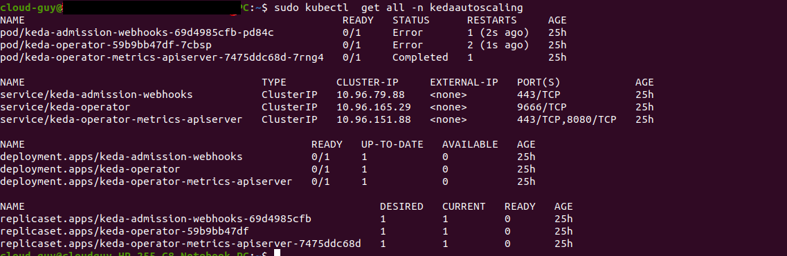

### Kubernetes Event-driven Autoscaling using KEDA

1. First, add the Helm repository and list the available charts

```

helm repo add kedacore https://kedacore.github.io/charts

helm repo update 
```

2. Installation on the cluster

```
kubectl create namespace kedaautoscaling 

helm install keda kedacore/keda --namespace kedaautoscaling
```

3. See all Kubernetes resources that are available for Prometheus / Grafana

```

kubectl get all -n kedaautoscaling
```




