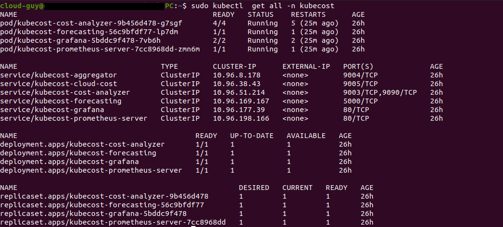

### Cost mangement using Kubecost

1. First, add the Helm repository and list the available charts

```

helm repo add kubecost https://kubecost.github.io/cost-analyzer/

helm repo update
```

2. Installation on the cluster

```
kubectl create namespace kubecost 

helm install kubecost kubecost/cost-analyzer -n kubecost
```

3. See all Kubernetes resources that are available for Kubecost

```

kubectl get all -n kubecost
```



4. Access kubecost Web UI

```
kubectl port-forward --namespace kubecost service/kubecost-cost-analyzer 8080:9090 -n kubecost

```


