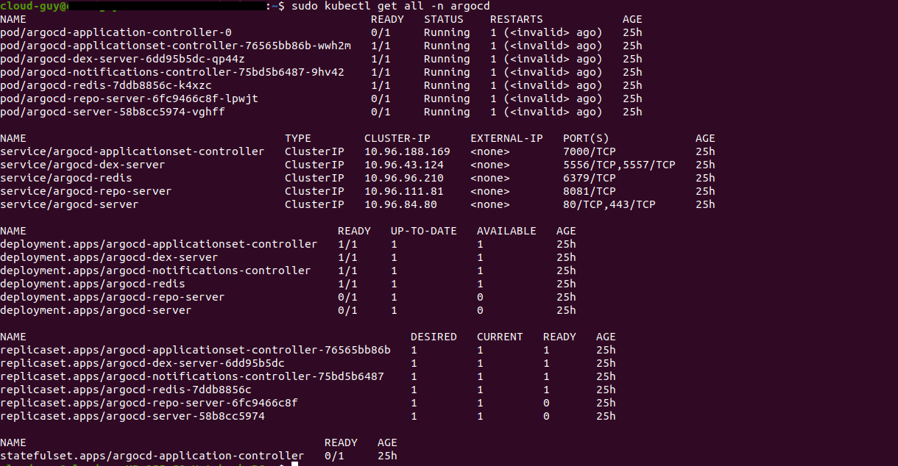

### GitOps using ArgoCD

1. First, add the Helm repository and list the available charts

```

helm repo add argo https://argoproj.github.io/argo-helm

helm repo update 
```

2. Installation on the cluster

```
kubectl create namespace argocd 

helm install argocd argo/argo-cd -n argocd
```

3. See all Kubernetes resources that are available for ArgoCD

```

kubectl get all -n argocd
```



4. Access ArgoCD Web UI

```
kubectl port-forward svc/argo-cd-argocd-server 8080:80 -n argocd

```

5. Credentials : The default username is `admin` and the password is auto-generated. 

```
kubectl get secret argocd-initial-admin-secret -o jsonpath="{.data.password}" | base64 -d

```

