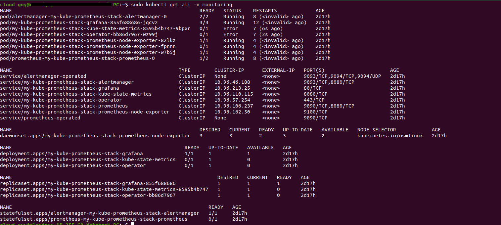

### Deploy a monitoring stack using Prometheus and Grafana

1. First, add the Helm repository and list the available charts

```

helm repo add prometheus-community https://prometheus-community.github.io/helm-charts

helm repo update 
```

2. Installation on the cluster

```
helm install kube-prometheus-stack \
  --create-namespace \
  --namespace kube-prometheus-stack \
  prometheus-community/kube-prometheus-stack
```

3. See all Kubernetes resources that are available for Prometheus / Grafana

```

kubectl get all -n monitoring
```



4. Access Prometheus 

```
kubectl port-forward svc/kube-prom-stack-kube-prome-prometheus 9090:9090 -n monitoring

```

5. Visualizing metrics using Grafana

```
kubectl --namespace monitoring port-forward svc/kube-prom-stack-grafana 3000:80

```

