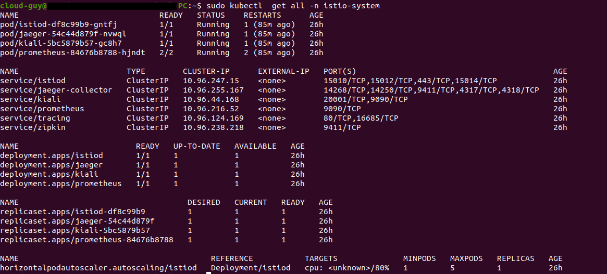
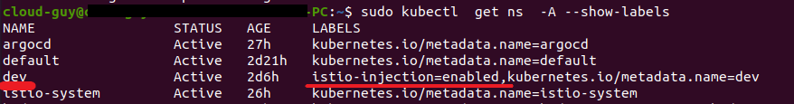

### Service mesh using : Istio, Kiali

1. First, add the Helm repository and list the available charts

```

helm repo add istio https://istio-release.storage.googleapis.com/charts

helm repo update 
```

2. Installation on the cluster

```
kubectl create namespace istio-system       

helm install istio-base istio/base -n istio-system --set defaultRevision=default 
```

3. See all Kubernetes resources that are available for Istio

```

kubectl get all -n istio-system 
```




4. Label the `dev` namespace to enable automatic sidecar injection:

```
kubectl label namespace dev istio-injection=enabled

```




